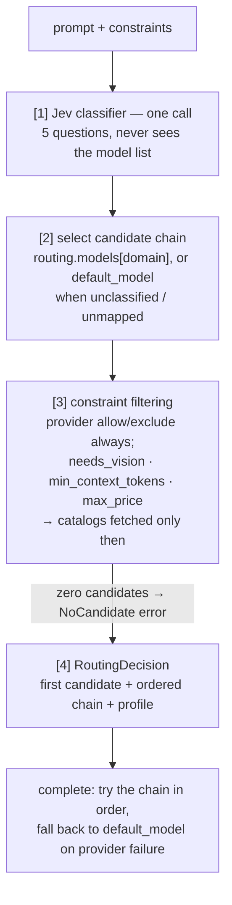

# jev-router (Go)

jev-router routes each prompt to a large language model. It classifies the
prompt with one small model call, then picks from a chain of models you
configured for that type of request. If a model fails, it tries the next one
in the chain.

It's a multi-provider router with a CLI, an HTTP server, OpenTelemetry traces
and metrics, and an evaluation harness. v2 replaced an earlier price-based
scorer with the explicit chain-based routing described below — a breaking
change, documented in [docs/design-notes.md](docs/design-notes.md).

> **Status:** feature-complete (see
> [docs/plans/](docs/plans/) for design history). Live routing and evals
> need your own `OPENROUTER_API_KEY`.

Requires Go 1.26 or newer (the module declares `go 1.26.0`).

## Quickstart

One OpenRouter key is enough to try it: it covers classification, the model
catalog, and completions.

```bash
export OPENROUTER_API_KEY=...
export JEV_ROUTER_DEFAULT_MODEL=google/gemini-3-flash-preview   # a cheap real model

go run ./cmd/jev-router route "Fix this off-by-one bug in my Go loop"
go run ./cmd/jev-router complete "What is the capital of France?"
go run ./cmd/jev-router models
```

Without `--config`, every command runs in **environment-only mode**: it reads
`OPENROUTER_API_KEY` and a `default_model` from `JEV_ROUTER_DEFAULT_MODEL`
(provider from `JEV_ROUTER_DEFAULT_PROVIDER`, default `openrouter`). There
are no per-domain chains in this mode, so every request routes through the
default model. If `JEV_ROUTER_DEFAULT_MODEL` is unset, validation fails and
names it. Everything else uses the defaults in
[Configuration](#configuration).

For real use, write a config file that lists your providers and per-domain
chains, then run:

```bash
go run ./cmd/jev-router validate --config jev-router.yaml
go run ./cmd/jev-router serve --config jev-router.yaml
```

## How it works



1. **Classify.** One Jev call (5-second timeout by default) answers five
   questions: domain (`code`, `math_reasoning`, `creative`, `factual_lookup`,
   or `other`), complexity (0–2), `needs_long_context`, `needs_vision`, and
   `latency_sensitive`. The classifier never sees your model list.
2. **Select.** The classified domain picks its configured chain
   (`routing.models.<domain>`). If the request has no domain, or the domain
   has no chain, the chain is just `default_model`. `default_model` is also
   appended to every domain chain as the last fallback, unless it's already
   there. The decision reports its `source` as `classification` or
   `default`.
3. **Filter.** `allowed_providers` and `excluded_providers` always apply.
   `needs_vision`, `min_context_tokens`, and `max_price_per_1k_tokens` need
   catalog data (prices, context length, vision support), so the router
   fetches catalogs only when one of those three is set — and it fetches
   them before classifying, so a request that can never be satisfied never
   wastes a Jev call. A failing catalog fails the whole route (every error is
   reported, not silently dropped); a candidate model missing from the
   catalogs fails the same checks. Catalogs never affect *which* chain gets
   picked, only which candidates survive the filter.
4. **Decide, then complete.** The decision names the first candidate and the
   full ordered chain. `complete` tries each candidate on its own provider
   (using the provider's native model ID — no translation between
   providers), moving to the next on any failure, with `default_model` as
   the last resort.

**When the classifier fails:** `fail_open` (the default) routes straight to
`default_model` with no profile, and logs a warning. `fail_closed` returns
the error instead. Either way, the router never invents a fake profile.

## Providers

| Configured name | Catalog source | Completion |
|-----------------|----------------|------------|
| `openrouter` (default) | **live** OpenRouter catalog (cached, with stale fallback) | chat completions via the official OpenRouter Go SDK |
| `openai` | catalog file you supply | chat completions (official openai-go) |
| `anthropic` | catalog file you supply | Messages API (official anthropic-sdk-go) |
| `gemini` | catalog file you supply | generateContent (official google genai SDK) |
| `bedrock` | catalog file you supply | Converse (aws-sdk-go-v2) |
| any `providers.compatible[]` name (e.g. `groq`, `ollama`) | catalog file you supply | OpenAI-wire chat completions against your `base_url` (openai-go) |

Only OpenRouter publishes a public price API. Every other provider needs a
catalog file with prices you maintain — see
[docs/catalog-format.md](docs/catalog-format.md) for the format. These
catalogs no longer decide routing; they feed the `models` CLI listing and
the `needs_vision`/`min_context_tokens`/`max_price_per_1k_tokens` checks.
Completions always run on the selected candidate's own provider.

## Configuration

Pass a YAML file with `--config PATH`, or set `JEV_ROUTER_CONFIG`. The
example below is complete — copy it and edit it.

Settings apply in this order, highest priority first: **command-line flags,
then environment variables, then the YAML file, then built-in defaults.**
`JEV_ROUTER_DEFAULT_MODEL` (with `JEV_ROUTER_DEFAULT_PROVIDER`) always wins
over `routing.default_model` in the file. Catalog paths in the file resolve
relative to the **file's own directory**, so you can move a config and its
catalogs together without breaking the paths. The file is decoded strictly:
an unknown field is an error, including the old scorer keys listed below.

```yaml
providers:
  openrouter:      { api_key: "", api_key_env: OPENROUTER_API_KEY }
  openai:          { api_key: "", api_key_env: OPENAI_API_KEY,    catalog: catalogs/openai.yaml }
  anthropic:       { api_key: "", api_key_env: ANTHROPIC_API_KEY, catalog: catalogs/anthropic.yaml }
  gemini:          { api_key: "", api_key_env: GEMINI_API_KEY,    catalog: catalogs/gemini.yaml }
  bedrock:         { region: us-east-1,                           catalog: catalogs/bedrock.yaml }
  compatible:
    - { name: groq, base_url: https://api.groq.com/openai/v1, api_key_env: GROQ_API_KEY, catalog: catalogs/groq.yaml }
classifier:        { base_url: https://openrouter.ai, path: /api/v1/systemone, model: "~typesafe/jev-latest", timeout: 5s }
routing:
  catalog_cache_ttl: 10m
  on_classifier_error: fail_open    # fail_open | fail_closed
  models:                           # ordered candidate chains per domain
    code:
      - { provider: openrouter, model: google/gemma-4-26b-a4b-it }
      - { provider: anthropic,  model: claude-opus-4-5 }
    math_reasoning:
      - { provider: anthropic,  model: claude-opus-4-5 }
    # unmapped domains (and unclassified requests) use default_model
  default_model: { provider: openrouter, model: google/gemini-3-flash-preview }
  allowed_providers: []             # empty = all configured providers
  excluded_providers: []
server:            { addr: ":8080", read_timeout: 30s }
telemetry:         { enabled: auto } # auto = on when OTEL_EXPORTER_OTLP_ENDPOINT is set
```

A few rules worth knowing:

- `routing.models` keys must be one of the five domains (`code`,
  `math_reasoning`, `creative`, `factual_lookup`, `other`). Every chain
  needs at least one entry, and every entry needs a `provider` and `model`.
  Every provider you reference must be configured. You need at least one of
  `models` or `default_model`.
- **Breaking change (v2):** the old scorer keys (`confidence_threshold`,
  `weight_complexity_match`, `weight_domain`) are rejected outright. Migrate
  to `models` and `default_model` — see [docs/design-notes.md](docs/design-notes.md).
- A literal `api_key` wins over `api_key_env`, but prefer `api_key_env` —
  don't put real keys in a shared file.
- `classifier.base_url`, `path`, and `model` are configurable, so switching
  to TypeSafe directly is a config change, not a code change.
- Bedrock uses the standard AWS credential chain (environment, profile,
  IMDS); you only configure `region`.
- Every `providers.compatible[]` name must be unique, and becomes a
  provider name you can reference in `routing.models`.

Environment variables:

| Variable | Used for |
|----------|----------|
| `JEV_ROUTER_CONFIG` | config file path, when `--config` isn't given |
| `JEV_ROUTER_SERVER_ADDR` | overrides `server.addr` |
| `JEV_ROUTER_DEFAULT_MODEL` | sets or overrides `routing.default_model` (model ID); required in environment-only mode |
| `JEV_ROUTER_DEFAULT_PROVIDER` | provider for `JEV_ROUTER_DEFAULT_MODEL` (default `openrouter`) |
| `OPENROUTER_API_KEY` | default key in environment-only mode; also an `api_key_env` name in the reference config |
| `OPENAI_API_KEY`, `ANTHROPIC_API_KEY`, `GEMINI_API_KEY`, `GROQ_API_KEY` | `api_key_env` names used above (any names work — they're config, not code) |
| AWS credential-chain variables (`AWS_REGION`, `AWS_PROFILE`, …) | Bedrock credentials |
| `OTEL_EXPORTER_OTLP_ENDPOINT` (+ standard `OTEL_EXPORTER_OTLP_*`) | turns telemetry on in `auto` mode; configures the OTLP exporters |
| `JEV_ROUTER_LIVE_COMPLETION` | test-only: also runs the billed completion integration test |

## HTTP API

`jev-router serve` exposes the router over HTTP. **v1 has no
authentication** — run it on localhost, or behind a reverse proxy. Every
response is JSON, including errors (`{"error","code"}`) and 404/405.

| Endpoint | Method | Body / query | Response |
|----------|--------|--------------|----------|
| `/v1/route` | POST | `{"prompt": "...", "constraints": {...}?}` | routing decision JSON |
| `/v1/complete` | POST | `{"prompt"?,"messages"?, "constraints"?, "max_tokens"?, "temperature"?}` (need `prompt` or `messages`) | completion JSON |
| `/v1/chat/completions` | POST | OpenAI Chat Completions body (see [OpenAI compatibility](#openai-compatibility)) | OpenAI `chat.completion` JSON |
| `/v1/models` | GET | — | OpenAI model list (one virtual model, `auto`) |
| `/v1/models/{id}` | GET | — | OpenAI model object (`auto` only; others 404) |
| `/healthz` | GET | — | `{"status":"ok"}` |

Request bodies are capped at 4 MiB (`413` beyond that). Successful completions
carry `X-Jev-Router-Model`, `X-Jev-Router-Provider` and `X-Jev-Router-Source`
headers naming the routing outcome.

Error codes: `invalid_request` (400), `no_candidate` (422),
`catalog_unavailable` / `classifier_unavailable` / `provider_error` (502),
`internal` (500), `not_found` (404), `method_not_allowed` (405, with an
`Allow` header). Every request gets an `X-Request-ID` (passed through, or
generated) and one structured log line. Panics are recovered into JSON 500s.

Completions are synchronous: `POST /v1/complete` always returns one JSON
result. There is no streaming or SSE. A `"stream": true` body field is
ignored, like any other unknown field, so old callers still get their
result back.

### OpenAI compatibility

Point any OpenAI SDK or tool at the router and it works as a chat backend:

```bash
curl http://localhost:8080/v1/chat/completions \
  -H 'Content-Type: application/json' \
  -d '{"model":"auto","messages":[{"role":"user","content":"What is the capital of France?"}]}'
```

```python
from openai import OpenAI
client = OpenAI(base_url="http://localhost:8080/v1", api_key="unused")
client.chat.completions.create(model="auto", messages=[{"role": "user", "content": "hi"}])
```

- **One shot, no streaming.** The reply is a single `chat.completion` JSON
  object. `"stream": true` is rejected with a 400 (`streaming_not_supported`)
  rather than ignored, because an SDK that asked for SSE would otherwise fail
  with a confusing parse error.
- **The router picks the model.** `model` may be any value (`auto`,
  `jev-router`, `gpt-4o`, ...) and is ignored; the response's `model` names
  the model that actually served the request. The router classifies the last
  user message. An optional `constraints` object (same as `/v1/complete`) is
  accepted as an extension.
- **Authentication is not enforced.** SDKs require an API key; send anything.
  The `Authorization` header is ignored.
- **Supported:** `system`/`developer`/`user`/`assistant` messages, string or
  text-part content, `max_tokens`/`max_completion_tokens` (the latter wins),
  `temperature`. Pure sampling knobs (`top_p`, `seed`, penalties, `user`) and
  unknown fields are ignored.
- **Rejected with 400** (anything that would change the output contract):
  `stream: true`, `n` other than 1, non-empty `tools`/`functions`,
  `tool`/`function` roles, non-text content parts (images, audio), empty
  message content, `response_format` other than `text` (JSON mode and
  structured outputs), `logprobs`, and `stop`.
- **No SDK retry storms.** 5xx responses carry `X-Should-Retry: false`, since
  the router has already tried the whole candidate chain.
- **Errors** on these paths use OpenAI's envelope
  (`{"error":{"message","type","param","code"}}`); `finish_reason` is
  normalized to `stop`, `length` or `content_filter`; `usage` is always present
  (zeros when the provider reports none).

## CLI

| Command | Purpose | Flags |
|---------|---------|-------|
| `route <prompt>` | route a prompt; print the model, provider, domain, source, and the ordered candidate chain (no prices) | `--json`, constraint flags |
| `complete <prompt>` | route, then complete on the candidate chain (with fallback); print the content | `--json`, `--system TEXT`, `--max-tokens N`, `--temperature F`, constraint flags |
| `models` | list routable models after constraints | `--json`, constraint flags |
| `serve` | serve the HTTP API until SIGINT/SIGTERM (graceful shutdown) | `--addr` |
| `validate` | load a config, resolve keys, parse catalogs — fully offline | `--config` (required) |
| `eval` | run the labeled-prompt evaluation | `--json FILE\|-`, `--min-accuracy 0.75`, `--repeat N` |
| `version` | print the version | — |

Every subcommand also takes `--log-level debug|info|warn|error` and
`--log-format text|json`. Constraint flags — shared by `route`, `complete`,
and `models` — are `--needs-vision`, `--min-context`, `--max-price`,
`--providers`, and `--excluded-providers`. Logs go to stderr; command output
goes to stdout.

**Exit codes:** `0` success, `1` runtime or API failure, `2` usage error,
`3` eval accuracy below `--min-accuracy`. Errors print as
`jev-router: <err>` on stderr.

## Evals

`jev-router eval` routes 8 hand-labeled prompts and checks each decision
against the expected domain.
Accuracy means classification-domain correctness — the old cheapness check
retired with the price scorer. Price columns (chosen/median/frontier
blended price, savings vs. frontier) need a live model pool; the CLI fetches
one when it can and reports `0` when it can't.

```bash
OPENROUTER_API_KEY=... JEV_ROUTER_DEFAULT_MODEL=google/gemini-3-flash-preview \
  go run ./cmd/jev-router eval                 # live (billed classifier calls)
OPENROUTER_API_KEY=... JEV_ROUTER_DEFAULT_MODEL=google/gemini-3-flash-preview \
  go run ./cmd/jev-router eval --json report.json --min-accuracy 0.75
make eval                                                           # first line, via the Makefile
```

- **Live run:** needs a working classifier (`OPENROUTER_API_KEY`, or any
  config with OpenRouter). Each prompt makes one real, billed Jev call.
- **Offline:** with a catalog-only config (no working classifier), every
  prompt is reported `skipped` and the command exits `1`. The table still
  prints, so you can check the wiring without spending anything.
- **Exit 3** means accuracy missed `--min-accuracy`. The report is written
  before the exit check runs, so a failing run still produces its file
  (`--json -` prints pure JSON to stdout instead of the human table).

## Testing

- **Unit tests** are always offline — no keys, no network:
  `go test ./...`, or `go test -race -count=1 ./...` to check for races.
- **Integration tests** need keys and are skipped without them:
  `OPENROUTER_API_KEY=... go test -run Integration ./catalog/openrouter ./config`
  fetches the live catalog and makes one real Jev call. Setting
  `JEV_ROUTER_LIVE_COMPLETION=1` also runs one small billed completion.
  These never run in CI.
- **HTTP smoke test:** builds the binary, starts `serve` on
  `127.0.0.1:8199` (override with `--addr`), and curls every endpoint:
  `./scripts/api-smoke.sh [--config PATH] [--no-complete]`, or `make smoke`.
  It picks a config the same way the CLI does: `--config`, then
  `$JEV_ROUTER_CONFIG`, then `jev-router.local.yaml` if present, then
  environment-only defaults. `--no-complete` skips the one billed
  completion check.
- `make build|test|test-race|cover|vet|lint` wrap the common commands. CI
  (`.github/workflows/ci.yml`) runs build, vet, `go test -race` with
  coverage, and golangci-lint (config: `.golangci.yml`).

## Troubleshooting

### OpenRouter guardrail 404s

`complete` can fail with a 404 saying no endpoints match your guardrail
restrictions and data policy. This means your OpenRouter account (or
workspace) privacy settings — often a Zero Data Retention policy — block
some endpoints before your request is even sent. That typically removes
`:free` models and other cheap options, so a chain that names a blocked
model fails on that candidate. The router can't see your account's
guardrail settings, so it can't filter these out ahead of time; OpenRouter's
404 comes back unchanged. Fallback still helps: a chain like
`[blocked-model, working-model]` still succeeds, via the second candidate,
and `default_model` is the last resort. To change the policy, visit
<https://openrouter.ai/settings/privacy>.

## Telemetry

jev-router uses the OpenTelemetry API only in most of the code; the SDK and
exporters live in one package (`internal/telemetry`), wired in by `serve`
when telemetry is on. When telemetry is off or unconfigured, it does
nothing — zero configuration changes nothing.

- **Traces:** `modelrouter.route`, `modelrouter.catalog.fetch` (only when a
  constraint needs catalog data), `modelrouter.classify`,
  `modelrouter.models`, `modelrouter.complete` — with attributes like
  `modelrouter.domain`, `modelrouter.complexity_score`,
  `modelrouter.source`, `modelrouter.candidates`, `modelrouter.attempts`,
  `modelrouter.fallback`, and `modelrouter.model_id`.
- **Metrics:** `modelrouter.decisions` (a counter, by model/provider/
  fallback/domain/source), `modelrouter.classify.duration` (a histogram, in
  seconds), `modelrouter.upstream.errors` (a counter, by provider and
  operation).
- **Turning it on:** set `telemetry.enabled: auto|on|off` in your config
  (`auto` turns on when `OTEL_EXPORTER_OTLP_ENDPOINT` is set). Exporters
  read the standard `OTEL_EXPORTER_OTLP_*` variables. `service.name`
  defaults to `jev-router`.

## Architecture

| Package | Contents |
|---------|----------|
| `modelrouter` (root) | public types, error model, `FilterModels`, chain selection, diagnostics, `Router` (`Route`/`Complete`/`ListModels`) |
| `config` | YAML schema, `Load`/`Validate`, env overrides, `Build` → assembled `App` |
| `catalog/openrouter` | live OpenRouter catalog: cached, with stale fallback |
| `catalog/static` | user JSON/YAML catalogs, validated up front |
| `classify` | Jev client (`POST /api/v1/systemone`, 5s timeout) |
| `provider/*` | one completion implementation per provider, plus a shared registry |
| `server` | HTTP API: request IDs, panic recovery, logging, graceful shutdown |
| `internal/cli` | the `jev-router` CLI |
| `internal/telemetry` | OpenTelemetry SDK and OTLP setup |
| `eval` | labeled prompts and the eval report |
| `cmd/jev-router` | `main` |

For internals aimed at contributors and coding agents, see
[AGENTS.md](AGENTS.md).

## Design notes and licensing

[docs/design-notes.md](docs/design-notes.md) maps documented behavior to its
Go implementation and test, and records the deliberate design decisions
behind it — including **v2**, which replaced an earlier price-based scorer
with the explicit per-domain chains described above.
[docs/catalog-format.md](docs/catalog-format.md) documents the catalog file
format. Licensed under [MIT](LICENSE).

## Roadmap

- An Azure OpenAI provider.
- Catalog dedup, for the same model contributed by two catalogs.
- Provider-internal spans and token/cost metrics.
- Server authentication (API keys or OIDC) and rate limiting.
- An OpenAPI description of the HTTP API.
